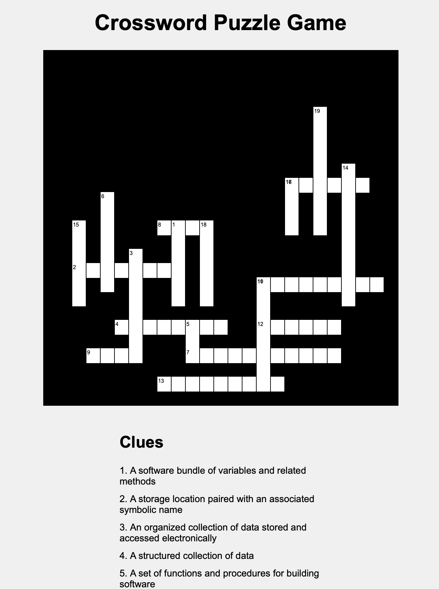
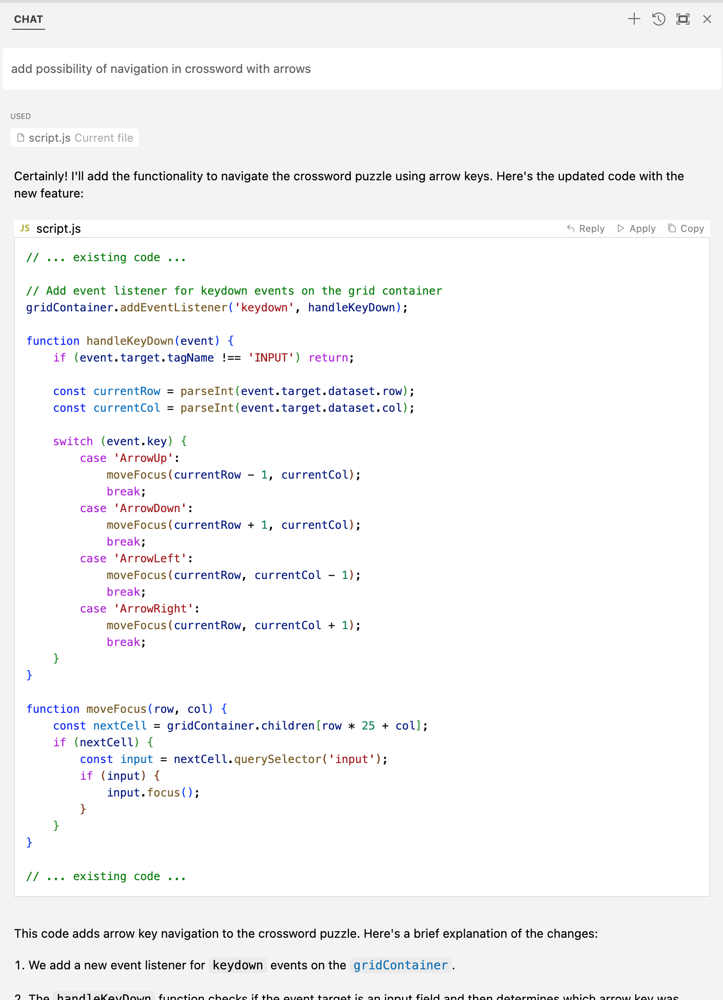
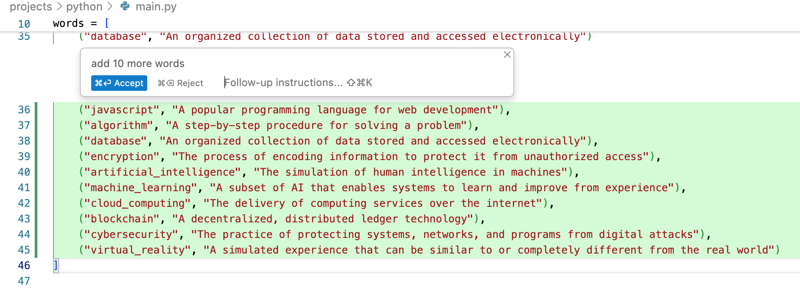

## Crossword Puzzle Game built with Cursor AI help

Cursor AI (with Claude 3.5 Sonnet) contributions:
- Generated the initial Python CLI version (prompt: "implement a simple cli-based crossword game").
- It got the game mechanics right.
- It created a simple stub for crossword generation: grid and used words structures, random word placement with multiple attempts and two directions, checking for intersections when placing words. It generated sample list of words and clues.
- It generated a simple web interface (prompt: "could you please create a simple web interface to play this game?") and made a couple of iterations on it with simple prompts ("add a button to check answers", "highlight incorrect words with red", "add possibility of navigation in crossword with arrows").

My contributions:
- Made the crossword generation more interesting: place words only with intersections, based on positions of already placed words instead of random placement on the grid. Make sure there's space between words on the grid and it's readable.
- Fix game mechanics: hide unsolved words and include clue numbers in the grid.

Observations:
- Initial AI-generated versions of both CLI game and web interface were surprisingly good.
- I wasn't successful in making significant changes to the crossword generation algorithm via prompting. However, I was able to make small incremental changes with prompting while iterating on the algorithm myself.
- Changing web UI with prompting worked much better, I didn't write any code myself.
- Semantic refactorings (such as "replace all prints of (x, y) with this method call; where (x, y) are different values in each callsite") and data generation (words and clues) were quite useful too.
- Code generation is very fast at this scale of the codebase, in 99% of cases I felt the workflow was quite natural and seamless.
- The whole things took like 4 hours to build (with only ~20 min spent on web version). I  certainly won't be able to do web version in such a short time and time spent on the CLI version with AI was also productive. The first couple ~1.5 hours I didn't attempt to build a clear mental model of the code AI wrote, I just tried to tinker with it by prompting and running, it was fun and unusual experience! It definitely unblocks playing with new technologies where one doesn't have enough experience to start from scratch quickly (beyond simple tutorials).

Example game - CLI:

```
Welcome to the Crossword Puzzle Game!
Fill in the words based on the clues provided.
Enter 'quit' to exit the game.
          
                                      1          
                                      9          
                                      *          
                                      *          
                                      *   1      
                                  1 6 * * 4 *    
        6                         7   *   *      
        *                         *   *   *      
    1   *       8 1 * 1           *   *   *      
    5   *         *   8                   *      
    *   *   3     *   *                   *      
    2 * * * * * * *   *                   *      
    *   *   *     *   *       1 1 * * * * * * *  
    *       *     *   *       0           *      
            *                 *                  
          4 * * * * 5 * *     1 2 * * * *        
            *       *         *                  
      9 * * *       7 * * * * * * * * * *        
                              *                  
                1 3 * * * * * * *                
                                                 

1. A software bundle of variables and related methods
2. A storage location paired with an associated symbolic name
3. An organized collection of data stored and accessed electronically
4. A structured collection of data
5. A set of functions and procedures for building software
6. A group of interconnected computers
7. A mechanism of basing an object or class upon another
8. A sequence of instructions that is continually repeated
9. An activity for fun
10. A block of organized, reusable code
11. A platform for developing software applications
12. A text editor
13. The process of identifying and removing errors from software
14. The process of encoding information
15. A computer program or device that provides functionality for other programs or devices
16. A piece of computer hardware or software that accesses a service made available by a server
17. Instructions for a computer
18. A programming language
19. A step-by-step procedure for solving a problem
Enter the word number and your guess (e.g., '1 python'):
```

Web interface:


Example chats with Cursor AI:

